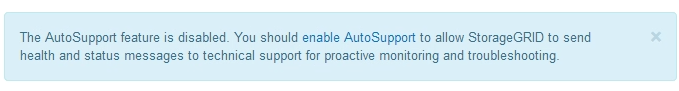

= 
:allow-uri-read: 

As mensagens do AutoSupport incluem informações como as seguintes:

* Versão do software StorageGRID
* Versão do sistema operativo
* Informações sobre atributos no nível do sistema e no nível da localização
* Alertas e alarmes recentes (sistema legado)
* Status atual de todas as tarefas de grade, incluindo dados históricos
* Utilização da base de dados do Admin Node
* Número de objetos perdidos ou perdidos
* Definições de configuração da grelha
* Entidades NMS
* Política ILM ativa
* Arquivo de especificação de grade provisionada
* Métricas de diagnóstico

Você pode ativar o recurso AutoSupport e as opções individuais do AutoSupport quando instalar o StorageGRID pela primeira vez, ou ativá-los posteriormente. Se o AutoSupport não estiver ativado, uma mensagem será exibida no painel Gerenciador de Grade. A mensagem inclui um link para a página de configuração do AutoSupport.

Se você fechar a mensagem, ela não aparecerá novamente até que o cache do navegador seja limpo, mesmo que o AutoSupport permaneça desativado.
