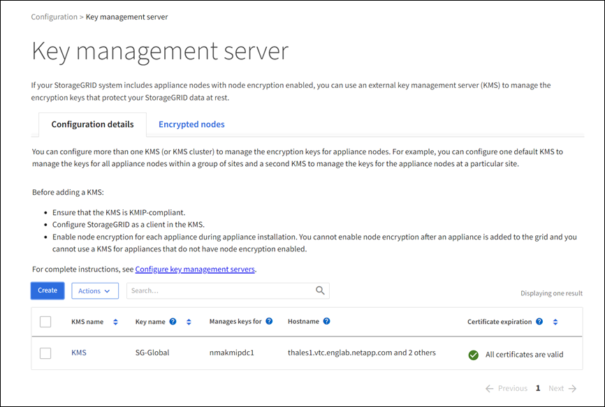
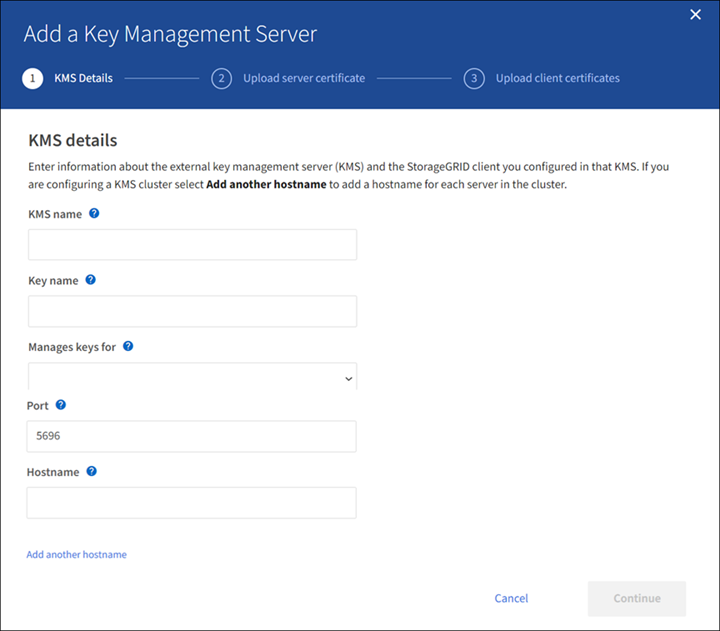
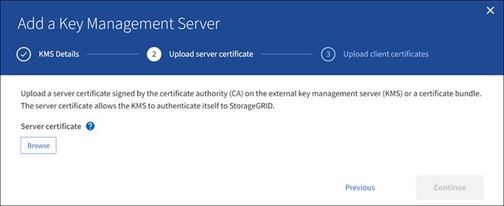
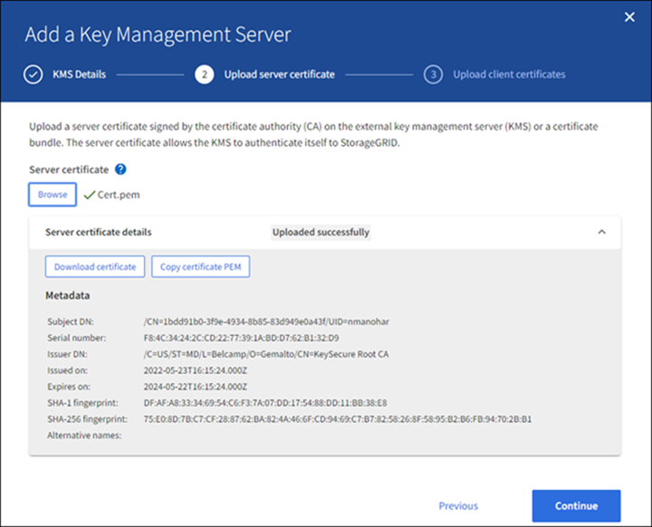
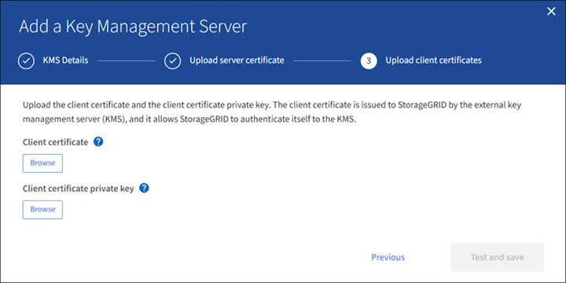
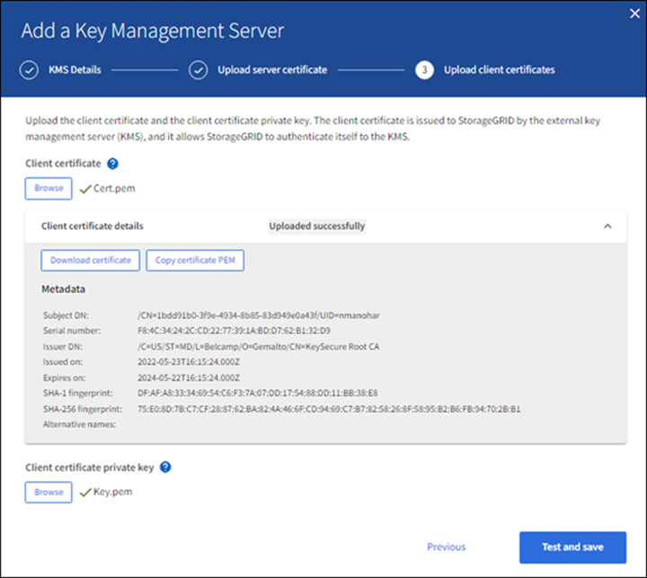

= Adicionar um servidor de gerenciamento de chaves (KMS)
:allow-uri-read: 
:icons: font
:imagesdir: ../media/

[role="lead"]
Você usa o assistente do servidor de gerenciamento de chaves do StorageGRID para adicionar cada cluster KMS ou KMS.

.Antes de começar
* Você revisou o link:kms-considerations-and-requirements.html["considerações e requisitos para usar um servidor de gerenciamento de chaves"].
* Você tem link:kms-configuring-storagegrid-as-client.html["Configurado o StorageGRID como um cliente no KMS"], e você tem as informações necessárias para cada cluster KMS ou KMS.
* Você está conetado ao Gerenciador de Grade usando um link:../admin/web-browser-requirements.html["navegador da web suportado"].
* Você tem a permissão de acesso root.

.Sobre esta tarefa
Se possível, configure qualquer servidor de gerenciamento de chaves específico do site antes de configurar um KMS padrão que se aplique a todos os sites não gerenciados por outro KMS. Se você criar o KMS padrão primeiro, todos os dispositivos criptografados por nó na grade serão criptografados pelo KMS padrão. Se você quiser criar um KMS específico do site mais tarde, primeiro copie a versão atual da chave de criptografia do KMS padrão para o novo KMS. link:kms-considerations-for-changing-for-site.html["Considerações para alterar o KMS para um site"]Consulte para obter detalhes.

== Passo 1: KMS detalhes

Na Etapa 1 (detalhes do KMS) do assistente Adicionar um servidor de gerenciamento de chaves, você fornece detalhes sobre o cluster KMS ou KMS.

.Passos
. Selecione *CONFIGURATION* > *Security* > *Key Management Server*.
+
A página servidor de gerenciamento de chaves é exibida com a guia Detalhes da configuração selecionada.

+

. Selecione *criar*.
+
A etapa 1 (detalhes do KMS) do assistente Adicionar um servidor de gerenciamento de chaves é exibida.

+

. Insira as seguintes informações para o KMS e o cliente StorageGRID que você configurou nesse KMS.
+
[cols="1a,2a"]
|===
| Campo | Descrição 

 a| 
KMS nome
 a| 
Um nome descritivo para ajudá-lo a identificar este KMS. Deve ter entre 1 e 64 carateres.

 a| 
Nome da chave
 a| 
O alias exato da chave para o cliente StorageGRID no KMS. Deve ter entre 1 e 255 carateres.

 a| 
Gere as chaves para
 a| 
O site StorageGRID que será associado a este KMS. Se possível, você deve configurar qualquer servidor de gerenciamento de chaves específico do site antes de configurar um KMS padrão que se aplica a todos os sites não gerenciados por outro KMS.

** Selecione um site se este KMS gerenciará chaves de criptografia para os nós do dispositivo em um local específico.
** Selecione *Sites não gerenciados por outro KMS (KMS padrão)* para configurar um KMS padrão que se aplicará a quaisquer sites que não tenham um KMS dedicado e a quaisquer sites que você adicionar em expansões subsequentes.
+
*Nota:* Um erro de validação ocorrerá quando você salvar a configuração do KMS se você selecionar um site que foi criptografado anteriormente pelo KMS padrão, mas você não forneceu a versão atual da chave de criptografia original para o novo KMS.

 a| 
Porta
 a| 
A porta que o servidor KMS usa para comunicações KMIP (Key Management Interoperability Protocol). O padrão é 5696, que é a porta padrão KMIP.

 a| 
Nome do anfitrião
 a| 
O nome de domínio ou endereço IP totalmente qualificado para o KMS.

*Nota:* o campo Nome alternativo (SAN) do assunto do certificado do servidor deve incluir o FQDN ou o endereço IP que você inserir aqui. Caso contrário, o StorageGRID não poderá se conetar ao KMS ou a todos os servidores em um cluster KMS.

|===
. Se você estiver configurando um cluster KMS, selecione *Adicionar outro nome de host* para adicionar um nome de host para cada servidor no cluster.
. Selecione *continuar*.

== Passo 2: Faça upload do certificado do servidor

Na Etapa 2 (carregar certificado do servidor) do assistente Adicionar um servidor de gerenciamento de chaves, você carrega o certificado do servidor (ou pacote de certificados) para o KMS. O certificado do servidor permite que o KMS externo se autentique no StorageGRID.

.Passos
. A partir de *passo 2 (carregar certificado do servidor)*, navegue até a localização do certificado ou pacote de certificados do servidor guardado.
+

. Carregue o ficheiro de certificado.
+
Os metadados do certificado do servidor são exibidos.

+

+

NOTE: Se você carregou um pacote de certificados, os metadados de cada certificado serão exibidos em sua própria guia.

. Selecione *continuar*.

== Passo 3: Faça upload de certificados de cliente

Na Etapa 3 (carregar certificados de cliente) do assistente Adicionar um servidor de gerenciamento de chaves, você carrega o certificado de cliente e a chave privada do certificado de cliente. O certificado de cliente permite que o StorageGRID se autentique no KMS.

.Passos
. A partir de *passo 3 (carregar certificados de cliente)*, navegue até a localização do certificado de cliente.
+

. Carregue o ficheiro de certificado do cliente.
+
Os metadados do certificado do cliente são exibidos.

. Navegue até a localização da chave privada para o certificado do cliente.
. Carregue o ficheiro de chave privada.
+

. Selecione *testar e salvar*.
+
As conexões entre o servidor de gerenciamento de chaves e os nós do dispositivo são testadas. Se todas as conexões forem válidas e a chave correta for encontrada no KMS, o novo servidor de gerenciamento de chaves será adicionado à tabela na página servidor de gerenciamento de chaves.

+

NOTE: Imediatamente após adicionar um KMS, o status do certificado na página Key Management Server (servidor de gerenciamento de chaves) aparece como desconhecido. Pode demorar StorageGRID até 30 minutos para obter o status real de cada certificado. Você deve atualizar o navegador da Web para ver o status atual.

. Se uma mensagem de erro for exibida quando você selecionar *Test and save*, revise os detalhes da mensagem e selecione *OK*.
+
Por exemplo, você pode receber um erro de entidade 422: Não processável se um teste de conexão falhar.

. Se você precisar salvar a configuração atual sem testar a conexão externa, selecione *Force save*.
+

WARNING: Selecionar *Force save* salva a configuração do KMS, mas não testa a conexão externa de cada dispositivo para esse KMS. Se houver um problema com a configuração, talvez você não consiga reinicializar os nós de dispositivo que têm a criptografia de nó ativada no site afetado. Você pode perder o acesso aos seus dados até que os problemas sejam resolvidos.

. Reveja o aviso de confirmação e selecione *OK* se tiver a certeza de que pretende forçar a gravação da configuração.
+
A configuração do KMS é salva, mas a conexão com o KMS não é testada.

