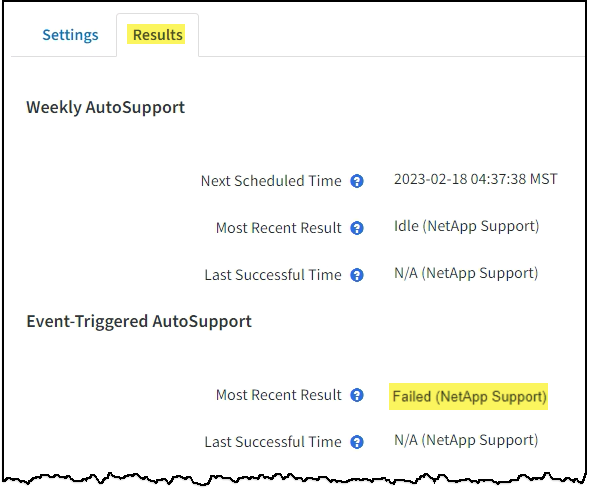

= Solucionar problemas de mensagens do AutoSupport
:allow-uri-read: 
:icons: font
:imagesdir: ../media/

[role="lead"]
Se uma tentativa de enviar uma mensagem AutoSupport falhar, o sistema StorageGRID executa ações diferentes dependendo do tipo de mensagem AutoSupport. Pode verificar o estado das mensagens do AutoSupport selecionando *SUPPORT* > *Tools* > *AutoSupport* > *results*.

Quando a mensagem AutoSupport não é enviada, "'Falha'" aparece na guia *resultados* da página *AutoSupport*.

NOTE: Se você configurou um servidor proxy para encaminhar mensagens do AutoSupport para o NetApp, você deve link:configuring-admin-proxy-settings.html["verifique se as configurações do servidor proxy estão corretas"].

== Falha semanal da mensagem AutoSupport

Se uma mensagem AutoSupport semanal não for enviada, o sistema StorageGRID executa as seguintes ações:

. Atualiza o atributo de resultado mais recente para tentar novamente.
. Tenta reenviar a mensagem AutoSupport 15 vezes a cada quatro minutos durante uma hora.
. Após uma hora de falhas de envio, atualiza o atributo de resultado mais recente para Falha.
. Tenta enviar uma mensagem AutoSupport novamente na próxima hora programada.
. Mantém a programação regular do AutoSupport se a mensagem falhar porque o serviço NMS não está disponível e se uma mensagem for enviada antes de sete dias passar.
. Quando o serviço NMS estiver disponível novamente, envia uma mensagem AutoSupport imediatamente se uma mensagem não tiver sido enviada por sete dias ou mais.

== Falha de mensagem AutoSupport acionada pelo usuário ou por evento

Se uma mensagem AutoSupport acionada pelo usuário ou por um evento não for enviada, o sistema StorageGRID executará as seguintes ações:

. Exibe uma mensagem de erro se o erro for conhecido. Por exemplo, se um usuário selecionar o protocolo SMTP sem fornecer as configurações corretas de e-mail, o seguinte erro é exibido: `AutoSupport messages cannot be sent using SMTP protocol due to incorrect settings on the E-mail Server page.`
. Não tenta enviar a mensagem novamente.
. Regista o erro no `nms.log`.

Se ocorrer uma falha e o SMTP for o protocolo selecionado, verifique se o servidor de e-mail do sistema StorageGRID está configurado corretamente e se o servidor de e-mail está em execução (*SUPPORT* > *Alarmes (legacy)* > *> Configuração de e-mail legado*). A seguinte mensagem de erro pode aparecer na página AutoSupport: `AutoSupport messages cannot be sent using SMTP protocol due to incorrect settings on the E-mail Server page.`

Aprenda a link:../monitor/email-alert-notifications.html["configure as definições do servidor de correio eletrónico"].

== Corrija uma falha de mensagem do AutoSupport

Se ocorrer uma falha e o SMTP for o protocolo selecionado, verifique se o servidor de e-mail do sistema StorageGRID está configurado corretamente e se o servidor de e-mail está em execução. A seguinte mensagem de erro pode aparecer na página AutoSupport: `AutoSupport messages cannot be sent using SMTP protocol due to incorrect settings on the E-mail Server page.`
