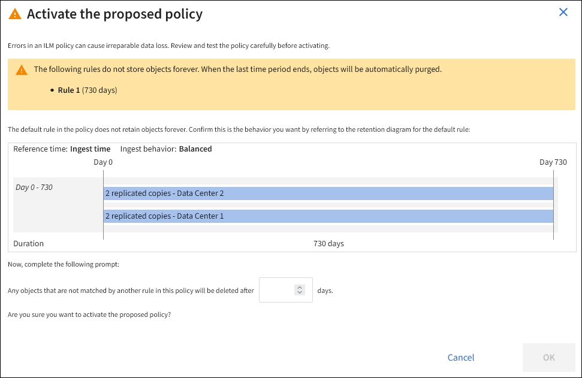

= Ative a política ILM
:allow-uri-read: 
:icons: font
:imagesdir: ../media/

[role="lead"]
Depois de adicionar regras ILM a uma política ILM proposta, simule a política e confirme que ela se comporta como você espera, você está pronto para ativar a política proposta.

.Antes de começar
* Você está conetado ao Gerenciador de Grade usando um link:../admin/web-browser-requirements.html["navegador da web suportado"].
* Você link:../admin/admin-group-permissions.html["permissões de acesso específicas"]tem .
* Você salvou e simulou a política de ILM proposta.

CAUTION: Erros em uma política ILM podem causar perda de dados irrecuperável. Analise e simule cuidadosamente a política antes de ativá-la para confirmar que funcionará como pretendido. Quando você ativa uma nova política de ILM, o StorageGRID a usa para gerenciar todos os objetos, incluindo objetos existentes e objetos recém-ingeridos. Antes de ativar uma nova política de ILM, revise todas as alterações no posicionamento de objetos replicados e codificados por apagamento existentes. Alterar a localização de um objeto existente pode resultar em problemas de recursos temporários quando os novos posicionamentos são avaliados e implementados.

.Sobre esta tarefa
Quando você ativa uma política de ILM, o sistema distribui a nova política para todos os nós. No entanto, a nova política ativa pode não ter efeito até que todos os nós de grade estejam disponíveis para receber a nova política. Em alguns casos, o sistema espera implementar uma nova política ativa para garantir que os objetos de grade não sejam removidos acidentalmente.

* Se você fizer alterações de política que aumentem a redundância ou a durabilidade dos dados, essas alterações serão implementadas imediatamente. Por exemplo, se você ativar uma nova política que inclua uma regra de três cópias em vez de uma regra de duas cópias, essa política será implementada imediatamente porque aumenta a redundância de dados.
* Se você fizer alterações de política que possam diminuir a redundância de dados ou a durabilidade, essas alterações não serão implementadas até que todos os nós de grade estejam disponíveis. Por exemplo, se você ativar uma nova política que usa uma regra de duas cópias em vez de uma regra de três cópias, a nova política aparecerá na guia diretiva ativa, mas ela não entrará em vigor até que todos os nós estejam online e disponíveis.

.Passos
. Quando estiver pronto para ativar uma política proposta, selecione *políticas ILM* > *Política proposta* e, em seguida, selecione *Ativar*.
+
É apresentada uma mensagem de aviso, solicitando-lhe que confirme que pretende ativar a política proposta.

+
Um prompt aparece na mensagem de aviso se a regra padrão não retiver objetos para sempre. Neste exemplo, o diagrama de retenção mostra que a regra padrão excluirá objetos após 730 dias (2 anos). Você deve digitar *730* na caixa de texto para confirmar que quaisquer objetos não correspondidos por outra regra na política serão removidos do StorageGRID após 730 dias.

+

. Selecione *OK*.

.Resultado
Quando uma nova política ILM tiver sido ativada:

* A política é apresentada no separador ative policy (Política ativa). A entrada de data de início indica a data e a hora em que a política foi ativada.
* A política ativa anteriormente aparece na guia Histórico de políticas. As entradas de data de início e data de término indicam quando a política se tornou ativa e quando ela não estava mais em vigor.

.Informações relacionadas
link:example-6-changing-ilm-policy.html["Exemplo 6: Alterando uma política ILM"]
