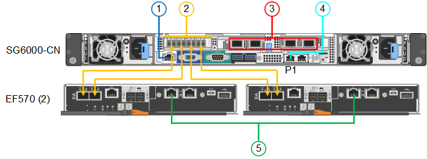

= Aparelho de cabo (SG6000)
:allow-uri-read: 
:icons: font
:imagesdir: ../media/

[role="lead"]
Você coneta os controladores de armazenamento ao controlador SG6000-CN, coneta as portas de gerenciamento em todos os três controladores e coneta as portas de rede no controlador SG6000-CN à rede de grade e à rede cliente opcional para StorageGRID.

.Antes de começar
* Você tem os quatro cabos óticos fornecidos com o aparelho para conetar os dois controladores de armazenamento ao controlador SG6000-CN.
* Você tem cabos Ethernet RJ-45 (quatro no mínimo) para conetar as portas de gerenciamento.
* Tem uma das seguintes opções para as portas de rede. Estes itens não são fornecidos com o aparelho.
+
** Um a quatro cabos Twinax para ligar as quatro portas de rede.
** Um a quatro transcetores SFP ou SFP28G se você planeja usar cabos óticos para as portas.
+

CAUTION: *Risco de exposição à radiação laser* -- não desmonte nem remova qualquer parte de um transcetor SFP. Você pode estar exposto à radiação laser.

.Sobre esta tarefa
As figuras a seguir mostram os três controladores nos dispositivos SG6060 e SG6060X, com o controlador de computação SG6000-CN na parte superior e os dois controladores de storage E2800 na parte inferior. O SG6060 usa controladores E2800A e o SG6060X usa controladores E2800B.

NOTE: Ambas as versões do controlador E2800 têm especificações e funções idênticas, exceto para a localização das portas de interconexão.

CAUTION: Não utilize um controlador E2800A e E2800B no mesmo aparelho.

SG6060 ligações:

image::../media/sg6000_e2800_connections.png[SG6060 a E2800A ligações]

SG6060X ligações:

image::../media/sg6000x_e2800B_connections.png[SG6060 a E2800B ligações]

A figura a seguir mostra as três controladoras no dispositivo SGF6024, com o controlador de computação SG6000-CN na parte superior e as duas controladoras de storage EF570 lado a lado abaixo do controlador de computação.

SGF6024 ligações:

[cols="1a,2a,2a,3a"]
|===
| Legenda | Porta | Tipo de porta | Utilização 

 a| 
1
 a| 
Porta de gerenciamento BMC no controlador SG6000-CN
 a| 
1 GbE (RJ-45)
 a| 
Liga-se à rede onde acede à interface BMC.

 a| 
2
 a| 
Portas de conexão FC:

* 4 no controlador SG6000-CN
* 2 em cada controlador de storage

 a| 
SFP ótico FC de 16 GB/s.
 a| 
Ligue cada controlador de armazenamento ao controlador SG6000-CN.

 a| 
3
 a| 
Quatro portas de rede no controlador SG6000-CN
 a| 
10/25-GbE
 a| 
Conete-se à rede de grade e à rede de cliente para StorageGRID.

 a| 
4
 a| 
Porta Admin Network no controlador SG6000-CN (identificada como P1 na figura)
 a| 
1 GbE (RJ-45)

*Importante:* esta porta funciona apenas a 1000 BaseT/full e não suporta velocidades de 10 ou 100 megabits.
 a| 
Liga o controlador SG6000-CN à rede de administração para StorageGRID.

 a| 
 a| 
Porta RJ-45 mais à direita no controlador SG6000-CN
 a| 
1 GbE (RJ-45)

*Importante:* esta porta funciona apenas a 1000 BaseT/full e não suporta velocidades de 10 ou 100 megabits.
 a| 
* Pode ser ligado com a porta de gerenciamento 1 se você quiser uma conexão redundante com a rede de administração.
* Pode ser deixado sem fios e disponível para acesso local temporário (IP 169.254.0.1).
* Durante a instalação, pode ser usado para conetar o controlador SG6000-CN a um laptop de serviço se os endereços IP atribuídos por DHCP não estiverem disponíveis.

 a| 
5
 a| 
Porta de gerenciamento 1 em cada controlador de storage
 a| 
1 GbE (RJ-45)
 a| 
Liga-se à rede onde acede ao Gestor de sistema SANtricity.

 a| 
 a| 
Porta de gerenciamento 2 em cada controlador de storage
 a| 
1 GbE (RJ-45)
 a| 
Reservado para suporte técnico.

|===
.Passos
. Conete a porta de gerenciamento BMC no controlador SG6000-CN à rede de gerenciamento, usando um cabo Ethernet.
+
Embora essa conexão seja opcional, recomenda-se facilitar o suporte.

. Conete as duas portas FC em cada controlador de storage às portas FC no controlador SG6000-CN, usando quatro cabos óticos e quatro transcetores SFP mais para os controladores de storage.
. Conete as portas de rede do controlador SG6000-CN aos switches de rede apropriados, usando cabos Twinax ou cabos óticos e transcetores SFP ou SFP28.
+

NOTE: As quatro portas de rede devem usar a mesma velocidade de link. Instale transcetores SFP se você planeja usar velocidades de link de 10 GbE. Instale os transcetores SFP28 se você planeja usar velocidades de link de 25 GbE.

+
** Se você planeja usar o modo de ligação de porta fixa (padrão), conete as portas à rede StorageGRID e às redes de clientes, conforme mostrado na tabela.
+
[cols="1a,2a"]
|===
| Porta | Liga a... 

 a| 
Porta 1
 a| 
Rede cliente (opcional)

 a| 
Porta 2
 a| 
Rede de rede

 a| 
Porta 3
 a| 
Rede cliente (opcional)

 a| 
Porta 4
 a| 
Rede de rede

|===
** Se você planeja usar o modo de ligação de porta agregada, conete uma ou mais portas de rede a um ou mais switches. Você deve conetar pelo menos duas das quatro portas para evitar ter um único ponto de falha. Se você usar mais de um switch para uma única ligação LACP, os switches devem suportar MLAG ou equivalente.

. Se pretender utilizar a rede de administração para StorageGRID, ligue a porta de rede de administração do controlador SG6000-CN à rede de administração, utilizando um cabo Ethernet.
. Se você planeja usar a rede de gerenciamento para o Gerenciador de sistemas SANtricity, conete a porta de gerenciamento 1 (P1) em cada controlador de armazenamento (a porta RJ-45 à esquerda) à rede de gerenciamento do Gerenciador de sistemas SANtricity, usando um cabo Ethernet.
+
Não use a porta de gerenciamento 2 (P2) nos controladores de storage (a porta RJ-45 à direita). Esta porta está reservada para suporte técnico.

.Informações relacionadas
link:../installconfig/port-bond-modes-for-sg6000-cn-controller.html["Modos de ligação de porta (controlador SG6000-CN)"]
