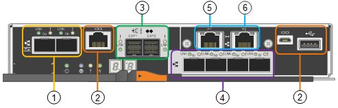

= SG5700 controladoras
:allow-uri-read: 
:icons: font
:imagesdir: ../media/

[role="lead"]
Os modelos SG5712 e SG5712X de 12 E5700SG unidades e SG5760 e SG5760X do dispositivo StorageGRID incluem um controlador de computação 60 e um controlador de storage e-Series E2800.

* O SG5712 e o SG5760 usam um controlador E2800A.
* O SG5712X e o SG5760X usam um controlador E2800B.

Os controladores E2800A e E2800B são idênticos em especificação e função, exceto para a localização das portas de interconexão.

== Controlador de computação E5700SG

* Opera como o servidor de computação do dispositivo.
* Inclui o instalador do dispositivo StorageGRID.
+

NOTE: O software StorageGRID não está pré-instalado no dispositivo. Este software é acessado a partir do Admin Node quando você implantar o dispositivo.

* Pode se conetar a todas as três redes StorageGRID, incluindo a rede de Grade, a rede Admin e a rede cliente.
* Liga-se ao controlador E2800 e funciona como iniciador.

=== Conetores E5700SG

[cols="1a,2a,2a,2a"]
|===
| Legenda | Porta | Tipo | Utilização 

 a| 
1
 a| 
Portas de interconexão 1 e 2
 a| 
Fibre Channel (FC) de 16GB GB/s, SFP ótico
 a| 
Ligue o controlador E5700SG ao controlador E2800.

 a| 
2
 a| 
Portas de diagnóstico e suporte
 a| 
* Porta serial RJ-45
* Porta serial micro USB
* Porta de USB

 a| 
Reservado para suporte técnico.

 a| 
3
 a| 
Portas de expansão da unidade
 a| 
SAS de 12GB GB/s.
 a| 
Não utilizado. Os dispositivos StorageGRID não são compatíveis com gavetas de unidades de expansão.

 a| 
4
 a| 
Portas de rede 1-4
 a| 
10 GbE ou 25 GbE, com base no tipo de transcetor SFP, na velocidade do switch e na velocidade do link configurada
 a| 
Conete-se à rede de grade e à rede de cliente para StorageGRID.

 a| 
5
 a| 
Porta de gerenciamento 1
 a| 
Ethernet de 1 GB (RJ-45)
 a| 
Conete-se à rede de administração para StorageGRID.

 a| 
6
 a| 
Porta de gerenciamento 2
 a| 
Ethernet de 1 GB (RJ-45)
 a| 
Opções:

* Vincular com a porta de gerenciamento 1 para uma conexão redundante com a rede de administração para StorageGRID.
* Deixe desconetado e disponível para acesso local temporário (IP 169.254.0.1).
* Durante a instalação, use a porta 2 para configuração IP se os endereços IP atribuídos pelo DHCP não estiverem disponíveis.

|===

== Controlador de storage E2800

Existem duas versões do controlador de armazenamento E2800 usado nos aparelhos SG5700: E2800A e E2800B. O E2800A não tem um HIC, e o E2800B tem um HIC de quatro portas. As duas versões de controlador têm especificações e funções idênticas, exceto para a localização das portas de interconexão.

O controlador de armazenamento da série E2800 tem as seguintes especificações:

* Funciona como o controlador de armazenamento do dispositivo.
* Gerencia o armazenamento de dados nas unidades.
* Funciona como um controlador padrão da série e no modo simplex.
* Inclui o software SANtricity os (firmware do controlador).
* Inclui o Gerenciador de sistema do SANtricity para monitorar o hardware do dispositivo e gerenciar alertas, o recurso AutoSupport e o recurso de segurança da unidade.
* Liga-se ao controlador E5700SG e funciona como alvo.

=== Conetores E2800A

image::../media/e2800_controller_with_callouts.gif[Conetores no controlador E2800A]

=== Conetores E2800B

image::../media/e2800B_controller_with_callouts.gif[Conetores no controlador E2800B]

[cols="1a,2a,2a,2a"]
|===
| Legenda | Porta | Tipo | Utilização 

 a| 
1
 a| 
Portas de interconexão 1 e 2
 a| 
SFP ótico FC de 16GB GB/s.
 a| 
Ligue o controlador E2800 ao controlador E5700SG.

 a| 
2
 a| 
Portas de gerenciamento 1 e 2
 a| 
Ethernet de 1 GB (RJ-45)
 a| 
* Opções da porta 1:
+
** Conete-se a uma rede de gerenciamento para permitir o acesso direto TCP/IP ao Gerenciador de sistemas SANtricity
** Deixe sem fio para salvar uma porta do switch e um endereço IP. Acesse o Gerenciador de sistema do SANtricity usando as UIs do instalador do Gerenciador de Grade ou do dispositivo de Grade de armazenamento.

*Nota*: Algumas funcionalidades opcionais do SANtricity, como a sincronização NTP para carimbos de data/hora precisos de registo, não estão disponíveis quando optar por deixar a porta 1 sem fios.

*Nota*: StorageGRID 11,5 ou superior e SANtricity 11,70 ou superior são necessários quando você deixa a porta 1 sem fio.

* A porta 2 está reservada para uso de suporte técnico.

 a| 
3
 a| 
Portas de diagnóstico e suporte
 a| 
* Porta serial RJ-45
* Porta serial micro USB
* Porta de USB

 a| 
Reservado para uso de suporte técnico.

 a| 
4
 a| 
Portas de expansão da unidade.
 a| 
SAS de 12GB GB/s.
 a| 
Não utilizado.

|===