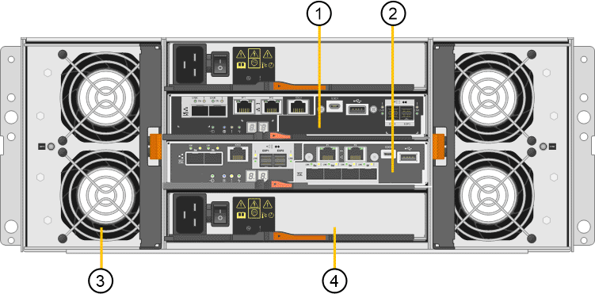

= Aparelho SG5700: Visão geral
:allow-uri-read: 
:icons: font
:imagesdir: ../media/

[role="lead"]
O dispositivo SG5700 StorageGRID é uma plataforma de storage e computação integrada que opera como nó de storage em uma grade StorageGRID. O dispositivo pode ser usado em um ambiente de grade híbrida que combina nós de storage do dispositivo e nós de storage virtuais (baseados em software).

O dispositivo da série StorageGRID SG5700 oferece os seguintes recursos:

* Integre os elementos de storage e computação para um nó de storage StorageGRID.
* Inclua o instalador do dispositivo StorageGRID para simplificar a implantação e a configuração do nó de storage.
* Inclui o e-Series SANtricity System Manager para gerenciamento e monitoramento de hardware.
* Suporte até quatro conexões de 10 GbE ou 25 GbE à rede de Grade StorageGRID e à rede de Cliente.
* Dar suporte a unidades Full Disk Encryption (FDE) ou unidades FIPS. Quando essas unidades são usadas com o recurso de Segurança da Unidade no Gerenciador de sistema do SANtricity, o acesso não autorizado aos dados é impedido.

O aparelho SG5700 está disponível em quatro modelos: SG5712 e SG5712X e SG5760 e SG5760X. Não existem diferenças funcionais ou de especificação entre o SG5712 e o SG5712X, exceto para a localização das portas de interconexão no controlador de armazenamento. Da mesma forma, não há especificação ou diferenças funcionais entre o SG5760 e o SG5760X, exceto para a localização das portas de interconexão no controlador de armazenamento.

== SG5700 componentes

Os modelos SG5700 incluem os seguintes componentes:

[cols="1a,1a,1a,1a,1a"]
|===
| Componente | SG5712 | SG5712X | SG5760 | SG5760X 

 a| 
Controlador de computação
 a| 
Controlador E5700SG
 a| 
Controlador E5700SG
 a| 
Controlador E5700SG
 a| 
Controlador E5700SG

 a| 
Controlador de storage
 a| 
Controlador E2800A
 a| 
Controlador E2800B
 a| 
Controlador E2800A
 a| 
Controlador E2800B

 a| 
Chassis
 a| 
Compartimento e-Series DE212C, um compartimento de duas unidades de rack (2UU)
 a| 
Compartimento e-Series DE212C, um compartimento de duas unidades de rack (2UU)
 a| 
Compartimento e-Series DE460C, um compartimento de quatro unidades de rack (4UU)
 a| 
Compartimento e-Series DE460C, um compartimento de quatro unidades de rack (4UU)

 a| 
Unidades
 a| 
Unidades NL-SAS de 12 TB (3,5 polegadas)
 a| 
Unidades NL-SAS de 12 TB (3,5 polegadas)
 a| 
Unidades NL-SAS de 60 TB (3,5 polegadas)
 a| 
Unidades NL-SAS de 60 TB (3,5 polegadas)

 a| 
Fontes de alimentação e ventiladores redundantes
 a| 
Dois coletores de ventilador de potência
 a| 
Dois coletores de ventilador de potência
 a| 
Dois coletores de energia e dois coletores de ventilador
 a| 
Dois coletores de energia e dois coletores de ventilador

|===
O storage bruto máximo disponível no dispositivo StorageGRID é fixo, com base no número de unidades em cada compartimento. Não é possível expandir o armazenamento disponível adicionando uma gaveta com unidades adicionais.

== SG5700 diagramas

=== SG5712 vistas dianteira e traseira

As figuras mostram a parte frontal e traseira do SG5712, um compartimento 2U com capacidade para 12 unidades.

image::../media/sg5712_front_and_back_views.gif[A parte frontal e traseira do aparelho SG5712]

=== SG5712 componentes

O SG5712 inclui dois controladores e dois coletores de ventilador.

image::../media/sg5712_with_callouts.gif[Controladores e coletores de ventilador no aparelho SG5712]

[cols="1a,3a"]
|===
| Legenda | Descrição 

 a| 
1
 a| 
Controlador E2800A (controlador de storage)

 a| 
2
 a| 
Controladora E5700SG (controlador de computação)

 a| 
3
 a| 
Coletores do ventilador de potência

|===

=== SG5712X vistas dianteira e traseira

As figuras mostram a parte frontal e traseira do SG5712X, um compartimento 2U com capacidade para 12 unidades.

image::../media/sg5712x_front_and_back_views.gif[A parte frontal e traseira do aparelho SG5712X]

=== SG5712X componentes

O SG5712X inclui dois controladores e dois coletores de ventilador.

image::../media/sg5712x_with_callouts.gif[Controladores e coletores de ventilador no aparelho SG5712X]

[cols="1a,3a"]
|===
| Legenda | Descrição 

 a| 
1
 a| 
Controlador E2800B (controlador de storage)

 a| 
2
 a| 
Controladora E5700SG (controlador de computação)

 a| 
3
 a| 
Coletores do ventilador de potência

|===

=== SG5760 vistas dianteira e traseira

As figuras mostram a parte frontal e traseira do modelo SG5760, um gabinete 4UU com capacidade para 60 unidades em 5 gavetas de unidade.

image::../media/sg5760_front_and_back_views.gif[Parte frontal e traseira do aparelho SG5760]

=== SG5760 componentes

O SG5760 inclui dois controladores, dois coletores de ventilador e dois coletores de energia.

[cols="1a,2a"]
|===
| Legenda | Descrição 

 a| 
1
 a| 
Controlador E2800A (controlador de storage)

 a| 
2
 a| 
Controladora E5700SG (controlador de computação)

 a| 
3
 a| 
Recipiente da ventoinha (1 de 2)

 a| 
4
 a| 
Recipiente de alimentação (1 de 2)

|===

=== SG5760X vistas dianteira e traseira

As figuras mostram a parte frontal e traseira do modelo SG5760X, um gabinete 4UU com capacidade para 60 unidades em 5 gavetas de unidade.

image::../media/sg5760x_front_and_back_views.gif[Parte frontal e traseira do aparelho SG5760X]

=== SG5760X componentes

O SG5760X inclui dois controladores, dois coletores de ventilador e dois coletores de energia.

image::../media/sg5760x_with_callouts.gif[Controladores,fan canisters,and power canisters in SG5760X appliance]

[cols="1a,3a"]
|===
| Legenda | Descrição 

 a| 
1
 a| 
Controlador E2800B (controlador de storage)

 a| 
2
 a| 
Controladora E5700SG (controlador de computação)

 a| 
3
 a| 
Recipiente da ventoinha (1 de 2)

 a| 
4
 a| 
Recipiente de alimentação (1 de 2)

|===
.Informações relacionadas
http://mysupport.netapp.com/info/web/ECMP1658252.html["Site de Documentação de sistemas NetApp e-Series"^]
