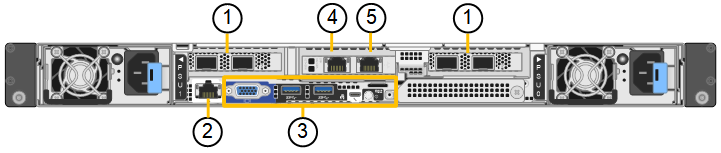

= Aparelho SGF6112: Visão geral
:allow-uri-read: 
:icons: font
:imagesdir: ../media/

[role="lead"]
O dispositivo StorageGRID SGF6112 opera como nó de storage em um sistema StorageGRID. O dispositivo pode ser usado em um ambiente de grade híbrida que combina nós de storage do dispositivo e nós de storage virtuais (baseados em software).

O aparelho SGF6112 fornece as seguintes funcionalidades:

* 12 unidades SSD NVMe (nonvolatile Memory Express) com controladores de storage e computação integrados.
* Integra os elementos de storage e computação de um nó de storage da StorageGRID.
* Inclui o instalador do dispositivo StorageGRID para simplificar a implantação e a configuração do nó de storage.
* Inclui um controlador de gerenciamento de placa base (BMC) para monitorar e diagnosticar o hardware no controlador de computação.
* Suporta até quatro conexões de 10 GbE ou 25 GbE à rede de Grade StorageGRID e à rede de cliente.

== Descrição do hardware SGF6112

O StorageGRID SGF6112 é um dispositivo all-flash que apresenta um design compacto com controlador de computação e controlador de storage integrados a um chassi de 1U U. O dispositivo dá suporte a 12 unidades SSD NVMe com capacidade de storage de até 15,3 TB por unidade.

=== Storage de objetos resiliente

O SGF6112 foi projetado com SSDs em um RAID que fornece os seguintes recursos de proteção de dados:

* Capacidade de funcionar após a falha de um único SSD sem impactos na disponibilidade de objetos.
* Capacidade de funcionar após várias falhas SSD com uma redução mínima necessária na disponibilidade de objetos (com base no design do esquema RAID subjacente).
* Totalmente recuperável, durante o serviço, de falhas de SSD que não resultam em danos extremos ao RAID que hospeda o volume raiz do nó (o sistema operacional StorageGRID).

== SGF6112 componentes de hardware

O aparelho SGF6112 inclui os seguintes componentes:

[cols="1a,2a"]
|===
| Componente | Descrição 

 a| 
Plataforma de computação e storage
 a| 
Um servidor de unidade de um rack (1UU) que inclui:

* Dois processadores 2,1/2,6 GHz 165 W que fornecem 48 núcleos
* 256 GB DE RAM
* 2 portas Gbase-T de 1/10 mm
* 4 portas Ethernet de 10/25 GbE
* 1 x unidade de inicialização interna de 256 GB (inclui software StorageGRID)
* Controlador de gerenciamento de placa base (BMC) que simplifica o gerenciamento de hardware
* Fontes de alimentação e ventiladores redundantes

|===

== SGF6112 diagramas

=== Vista dianteira SGF6112D.

Esta figura mostra a parte frontal do SGF6112 sem a moldura. O dispositivo inclui uma plataforma de computação e storage 1U que contém 12 unidades SSD.

image::../media/sgf6112_front_with_ssds.png[SGF6112 Vista frontal]

=== Vista traseira de SGF6112 mm

Esta figura mostra a parte de trás do SGF6112, incluindo as portas, os ventiladores e as fontes de alimentação.

[cols="1a,2a,2a,2a"]
|===
| Legenda | Porta | Tipo | Utilização 

 a| 
1
 a| 
Portas de rede 1-4
 a| 
10/25-GbE, com base no tipo de transcetor de cabo ou SFP (os módulos SFP28 e SFP mais são suportados), velocidade do switch e velocidade do link configurada.
 a| 
Conete-se à rede de grade e à rede de cliente para StorageGRID.

 a| 
2
 a| 
Porta de gerenciamento de BMC
 a| 
1 GbE (RJ-45)
 a| 
Ligue ao controlador de gestão da placa de base do aparelho.

 a| 
3
 a| 
Portas de diagnóstico e suporte
 a| 
* VGA
* USB
* Porta de console micro-USB
* Micro-SD slot module

 a| 
Reservado para uso de suporte técnico.

 a| 
4
 a| 
Admin Network port 1
 a| 
1/10-GbE (RJ-45)
 a| 
Ligue o dispositivo à rede de administração para StorageGRID.

 a| 
5
 a| 
Admin Network port 2
 a| 
1/10-GbE (RJ-45)
 a| 
Opções:

* Vincular com a porta de rede de administração 1 para uma conexão redundante com a rede de administração para StorageGRID.
* Deixe desconetado e disponível para acesso local temporário (IP 169.254.0.1).
* Durante a instalação, use a porta 2 para configuração IP se os endereços IP atribuídos pelo DHCP não estiverem disponíveis.

|===