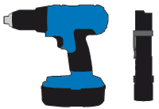

= Obtenha equipamentos e ferramentas adicionais
:allow-uri-read: 
:icons: font
:imagesdir: ../media/

[role="lead"]
Antes de instalar um dispositivo StorageGRID, confirme se tem todos os equipamentos e ferramentas adicionais de que necessita.

== Todos os aparelhos

Você precisa do seguinte equipamento para instalar e configurar todos os aparelhos.

[cols="1a,4a"]
|===
| Item | Como se parece 

 a| 
Chaves de parafusos
 a| 
image::../media/screwdrivers.gif[Duas chaves de parafusos]

* Chave de fendas Phillips n.o 2
* Chave de parafusos plana média

 a| 
Pulseira antiestática
 a| 
image::../media/appliance_wriststrap.gif[Pulseira antiestática]

 a| 
Serviço de laptop
 a| 
image::../media/sam_management_client.gif[Serviço de laptop]

* link:web-browser-requirements.html["Navegador da Web suportado"]
* Cliente SSH, como PuTTY
* Porta de 1 GbE (RJ-45)

NOTE: Algumas portas podem não suportar velocidades Ethernet de 10/100Mbps.

 a| 
Ferramentas opcionais
 a| 

* Broca elétrica com ponta Phillips
* Lanterna

|===

== SGF6112

Você precisa do seguinte equipamento adicional para instalar e configurar o hardware SGF6112.

[cols="1a,4a"]
|===
| Item | Como se parece 

 a| 
Cabos óticos e transcetores
 a| 
image::../media/fc_cable_and_sfp.gif[Cabo ótico e transcetor QSFP]

* Um a quatro destes tipos de cabos:
+
** Twinax/cobre
** Fibra/ótica

* Um a quatro desses transcetores/adaptadores baseados na velocidade do link (velocidades mistas não são suportadas):
+
** SFP de 10 GbE
** 25-GbE SFP28

 a| 
Cabos Ethernet RJ-45 (Cat5/Cat5e/Cat6/Cat6a)
 a| 
image::../media/ethernet_cables.png[Cabo Ethernet]

|===

== SG6000

Você precisa do seguinte equipamento adicional para instalar e configurar o hardware SG6000.

[cols="1a,4a"]
|===
| Item | Como se parece 

 a| 
Cabos óticos e transcetores SFP
 a| 
image::../media/fc_cable_and_sfp.gif[Cabo ótico e transcetor SFP]

* Um a quatro destes tipos de cabos:
+
** Twinax/cobre
** Fibra/ótica

* Um a quatro desses transcetores/adaptadores, com base na velocidade do link (velocidades mistas não são suportadas):
+
** SFP de 10 GbE
** 25-GbE SFP28

 a| 
Cabos Ethernet RJ-45 (Cat5/Cat5e/Cat6)
 a| 
image::../media/ethernet_cables.png[Cabos Ethernet]

 a| 
Ferramentas opcionais
 a| 
Elevador mecanizado para prateleiras de 60 unidades

|===

== SG5700

Você precisa do seguinte equipamento adicional para instalar e configurar o hardware SG5700.

[cols="1a,4a"]
|===
| Item | Como se parece 

 a| 
Cabos óticos e transcetores SFP
 a| 
image::../media/fc_cable_and_sfp.gif[Cabo ótico e transcetor SFP]

* Cabos óticos para as portas de 10/25 GbE que você planeja usar
* Opcional: SFP28 transcetores se você quiser usar a velocidade de link de 25 GbE

 a| 
Cabos Ethernet
 a| 
image::../media/ethernet_cables.png[Cabos Ethernet]

 a| 
Ferramentas opcionais
 a| 
Elevador mecanizado para SG5760

|===

== SG100 e SG1000

Você precisa do seguinte equipamento adicional para instalar e configurar o hardware SG100 e SG1000.

[cols="1a,4a"]
|===
| Item | Como se parece 

 a| 
Cabos óticos e transcetores
 a| 
image::../media/fc_cable_and_sfp.gif[Cabo ótico e transcetor QSFP]

* Um a quatro destes tipos de cabos:
+
** Twinax/cobre
** Fibra/ótica

* Um a quatro desses transcetores/adaptadores baseados na velocidade do link (velocidades mistas não são suportadas):
+
** SG100:
+
*** SFP de 10 GbE
*** 25-GbE SFP28

** SG1000:
+
*** Adaptador QSFP para SFP de 10 GbE (QSA) e SFP
*** Adaptador QSFP-to-SFP de 25 GbE (QSA) e SFP28
*** QSFP de 40 GbE
*** 100-GbE QFSP28

 a| 
Cabos Ethernet RJ-45 (Cat5/Cat5e/Cat6/Cat6a)
 a| 
image::../media/ethernet_cables.png[Cabo Ethernet]

|===