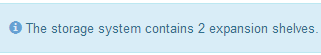

= Solucionar problemas de conexão (SG6000 ou SG5700)
:allow-uri-read: 
:icons: font
:imagesdir: ../media/

[role="lead"]
Se você encontrar problemas de conexão durante a instalação do StorageGRID Appliance, execute as etapas de ação corretiva listadas.

== Não foi possível ligar ao aparelho SG6000

Se você não conseguir se conetar ao dispositivo, pode haver um problema de rede ou a instalação do hardware pode não ter sido concluída com êxito.

.Passos
. Se você não conseguir se conetar ao Gerenciador do sistema do SANtricity:
+
.. Tente fazer ping no dispositivo usando o endereço IP para qualquer controlador de armazenamento na rede de gerenciamento para o Gerenciador de sistema SANtricity
`*ping _Storage_Controller_IP_*`
.. Se não receber resposta do ping, confirme que está a utilizar o endereço IP correto.
+
Use o endereço IP para a porta de gerenciamento 1 em qualquer controlador de armazenamento.

.. Se o endereço IP estiver correto, verifique o cabeamento do dispositivo e a configuração da rede.
+
Se isso não resolver o problema, entre em Contato com o suporte técnico.

.. Se o ping foi bem-sucedido, abra um navegador da Web.
.. Digite o URL para o Gerenciador de sistema do SANtricity
`*https://_Storage_Controller_IP_*`
+
É apresentada a página de início de sessão do Gestor do sistema SANtricity.

. Se não conseguir ligar ao controlador SG6000-CN:
+
.. Tente fazer ping no aparelho usando o endereço IP do controlador SG6000-CN
`*ping _SG6000-CN_Controller_IP_*`
.. Se não receber resposta do ping, confirme que está a utilizar o endereço IP correto.
+
Pode utilizar o endereço IP do dispositivo na rede de grelha, na rede de administração ou na rede de cliente.

.. Se o endereço IP estiver correto, verifique o cabeamento do dispositivo, os transcetores SFP e a configuração da rede.
.. Se o acesso físico ao SG6000-CN estiver disponível, você pode usar uma conexão direta com o IP local de link permanente `169.254.0.1` para verificar a configuração de rede do controlador e atualizar, se necessário. Para obter instruções detalhadas, consulte o passo 2 em link:accessing-storagegrid-appliance-installer.html["Acessando o Instalador de dispositivos StorageGRID"].
+
Se isso não resolver o problema, entre em Contato com o suporte técnico.

.. Se o ping foi bem-sucedido, abra um navegador da Web.
.. Digite o URL do instalador do StorageGRID Appliance
`*https://_SG6000-CN_Controller_IP_:8443*`
+
A página inicial é exibida.

== As prateleiras de expansão SG6060 não aparecem no Instalador de dispositivos

Se você tiver instalado prateleiras de expansão para o SG6060 e elas não aparecerem no Instalador de dispositivos StorageGRID, verifique se as prateleiras foram completamente instaladas e ligadas.

.Sobre esta tarefa
Você pode verificar se os compartimentos de expansão estão conetados ao dispositivo visualizando as seguintes informações no Instalador de dispositivos StorageGRID:

* A página *Home* contém uma mensagem sobre prateleiras de expansão.
+

* A página *Avançado* > *modo RAID* indica pelo número de unidades se o dispositivo inclui ou não compartimentos de expansão. Por exemplo, na captura de tela a seguir, dois SSDs e 178 HDDs são exibidos. Um SG6060 com dois compartimentos de expansão contém um total de 180 unidades.

image::../media/expansion_shelves_shown_by_num_of_drives.png[Número de unidades]

Se as páginas do Instalador do StorageGRID Appliance não indicarem que as prateleiras de expansão estão presentes, siga este procedimento.

.Passos
. Verifique se todos os cabos necessários foram firmemente conetados. link:cabling-appliance-sg6000.html["Aparelho de cabo (SG6000)"]Consulte .
. Verifique se você ativou as gavetas de expansão. link:connecting-power-cords-and-applying-power-sg6000.html["Conete os cabos de alimentação e ligue a alimentação (SG6000)"]Consulte .
. Se você precisar de ajuda para resolver um problema, entre em Contato com o suporte técnico.

== Não foi possível ligar ao aparelho SG5700

Se você não conseguir se conetar ao dispositivo, pode haver um problema de rede ou a instalação do hardware pode não ter sido concluída com êxito.

.Passos
. Se você não conseguir se conetar ao Gerenciador do sistema do SANtricity:
+
.. Tente fazer ping no dispositivo usando o endereço IP do controlador E2800 na rede de gerenciamento para o Gerenciador de sistema SANtricity
`*ping _E2800_Controller_IP_*`
.. Se não receber resposta do ping, confirme que está a utilizar o endereço IP correto.
+
Use o endereço IP para a porta de gerenciamento 1 no controlador E2800.

.. Se o endereço IP estiver correto, verifique o cabeamento do dispositivo e a configuração da rede.
+
Se isso não resolver o problema, entre em Contato com o suporte técnico.

.. Se o ping foi bem-sucedido, abra um navegador da Web.
.. Digite o URL para o Gerenciador de sistema do SANtricity
`*https://_E2800_Controller_IP_*`
+
É apresentada a página de início de sessão do Gestor do sistema SANtricity.

. Se não conseguir ligar ao controlador E5700SG:
+
.. Tente fazer ping no aparelho usando o endereço IP do controlador E5700SG
`*ping _E5700SG_Controller_IP_*`
.. Se não receber resposta do ping, confirme que está a utilizar o endereço IP correto.
+
Pode utilizar o endereço IP do dispositivo na rede de grelha, na rede de administração ou na rede de cliente.

.. Se o endereço IP estiver correto, verifique o cabeamento do dispositivo, os transcetores SFP e a configuração da rede.
+
Se isso não resolver o problema, entre em Contato com o suporte técnico.

.. Se o ping foi bem-sucedido, abra um navegador da Web.
.. Digite o URL do instalador do StorageGRID Appliance
`*https://_E5700SG_Controller_IP_:8443*`
+
A página inicial é exibida.

.Informações relacionadas
link:../installconfig/viewing-status-indicators.html["Ver indicadores de estado"]
