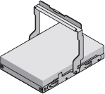

= Desembale caixas
:allow-uri-read: 
:icons: font
:imagesdir: ../media/

[role="lead"]
Antes de instalar o seu dispositivo StorageGRID, desembale todas as caixas e compare o conteúdo com os itens no saco de embalagem.

== SGF6112 aparelhos

=== Hardware

[cols="1a,4a"]
|===
| Item | Como se parece 

 a| 
SGF6112
 a| 
image::../media/sg6000_cn_front_without_bezel.gif[Unidades frontais do dispositivo SGF6112]

 a| 
Kit de calha com instruções
 a| 
image::../media/rail_kit.gif[Kit de calha]

 a| 
Painel frontal
 a| 
image::../media/sgf_6112_front_bezel.png[Painel frontal]

|===

=== Cabos de energia

O envio de um dispositivo SGF6112 inclui os seguintes cabos de alimentação.

TIP: O gabinete pode ter cabos de alimentação especiais que você usa em vez dos cabos de alimentação fornecidos com o aparelho.

[cols="1a,4a"]
|===
| Item | Como se parece 

 a| 
Dois cabos de energia para o seu país
 a| 
image::../media/power_cords.gif[Cabos de energia]

|===

== SG6000 aparelhos

=== Hardware SG6060

[cols="1a,4a"]
|===
| Item | Como se parece 

 a| 
Controlador SG6000-CN
 a| 
image::../media/sg6000_cn_front_without_bezel.gif[Controlador SG6000-CN]

 a| 
Compartimento de controladora E2860U sem unidades instaladas
 a| 
image::../media/de460c_table_size.gif[SG5760 4U aparelho]

 a| 
Duas molduras frontais
 a| 
image::../media/sg6000_front_bezels_for_table.gif[Molduras frontais]

 a| 
Dois kits de trilhos com instruções
 a| 
image::../media/rail_kit.gif[Kit de calha]

 a| 
Unidades de 60 TB (2 SSD e NL-SAS de 58 TB)
 a| 

 a| 
Quatro alças
 a| 
image::../media/handles.gif[SG5760 alças]

 a| 
Suportes traseiros e porcas de gaiola para instalação em rack de orifícios quadrados
 a| 
image::../media/back_brackets_table_size.gif[Suportes traseiros e porcas de gaiola para SG5760]

|===

=== Compartimento de expansão do SG6060

[cols="1a,4a"]
|===
| Item | Como se parece 

 a| 
Compartimento de expansão sem unidades instaladas
 a| 
image::../media/de460c_table_size.gif[SG5760 4U aparelho]

 a| 
Painel frontal
 a| 
image::../media/front_bezel_for_table_de460c.gif[Moldura frontal DE460C]

 a| 
Unidades NL-SAS de 60 TB
 a| 

 a| 
Um kit de trilho com instruções
 a| 
image::../media/rail_kit.gif[Kit de calha]

 a| 
Quatro alças
 a| 
image::../media/handles.gif[SG5760 alças]

 a| 
Suportes traseiros e porcas de gaiola para instalação em rack de orifícios quadrados
 a| 
image::../media/back_brackets_table_size.gif[Suportes traseiros e porcas de gaiola para SG5760]

|===

=== Hardware SGF6024

[cols="1a,4a"]
|===
| Item | Como se parece 

 a| 
Controlador SG6000-CN
 a| 
image::../media/sg6000_cn_front_without_bezel.gif[Controlador SG6000-CN]

 a| 
Array Flash de EF570 GB com 24 unidades de estado sólido (flash) instaladas
 a| 
image::../media/de224c_with_drives.gif[Compartimento de controladores EF570]

 a| 
Duas molduras frontais
 a| 
image::../media/sgf6024_front_bezels_for_table.png[SG6024 molduras frontais]

 a| 
Dois kits de trilhos com instruções
 a| 
image::../media/rail_kit.gif[Kit de calha]

 a| 
Tampas das prateleiras
 a| 
image::../media/endcaps.png[Tampas laterais]

|===

=== Cabos e conetores

O envio para um aparelho SG6000 inclui os seguintes cabos e conetores.

TIP: O gabinete pode ter cabos de alimentação especiais que você usa em vez dos cabos de alimentação fornecidos com o aparelho.

[cols="1a,4a"]
|===
| Item | Como se parece 

 a| 
Quatro cabos de energia para o seu país
 a| 
image::../media/power_cords.gif[Cabos de energia]

 a| 
Cabos óticos e transcetores SFP
 a| 
image::../media/fc_cable_and_sfp.gif[Cabos óticos e SFPs]

* Quatro cabos óticos para as portas de interconexão FC
* Quatro transcetores SFP mais, que suportam FC de 16 GB/s

 a| 
Opcional: Dois cabos SAS para conetar cada gaveta de expansão SG6060
 a| 
image::../media/sas_cable.gif[Cabos SAS]

|===

== SG5700 aparelhos

=== Hardware

[cols="1a,4a"]
|===
| Item | Como se parece 

 a| 
Dispositivo SG5712 com 12 unidades instaladas
 a| 
image::../media/de212c_table_size.gif[SG5712 2U aparelho]

 a| 
Dispositivo SG5760 sem unidades instaladas
 a| 
image::../media/de460c_table_size.gif[SG5760 4U aparelho]

 a| 
Moldura frontal para o aparelho
 a| 
image::../media/sg5700_front_bezels.gif[Molduras de SG5712 e SG5760]

 a| 
Kit de calha com instruções
 a| 
image::../media/rail_kit.gif[Kit de calha]

 a| 
SG5760: Sessenta unidades
 a| 

 a| 
SG5760: Alças
 a| 
image::../media/handles.gif[SG5760 alças]

 a| 
SG5760: Suportes traseiros e porcas de gaiola para instalação de rack de furo quadrado
 a| 
image::../media/back_brackets_table_size.gif[Suportes traseiros e porcas de gaiola para SG5760]

|===

=== Cabos e conetores

O envio para um aparelho SG5700 inclui os seguintes cabos e conetores.

TIP: O gabinete pode ter cabos de alimentação especiais que você usa em vez dos cabos de alimentação fornecidos com o aparelho.

[cols="1a,4a"]
|===
| Item | Como se parece 

 a| 
Dois cabos de energia para o seu país
 a| 
image::../media/power_cords.gif[Cabos de energia]

 a| 
Cabos óticos e transcetores SFP
 a| 
image::../media/fc_cable_and_sfp.gif[Cabos óticos e SFPs]

* Dois cabos óticos para as portas de interconexão FC
* Oito transcetores SFP mais, compatíveis com as quatro portas de interconexão FC de 16GB GB/s e as quatro portas de rede de 10 GbE

|===

== Aparelhos SG100 e SG1000

=== Hardware

[cols="1a,4a"]
|===
| Item | Como se parece 

 a| 
SG100 ou SG1000
 a| 
image::../media/sg6000_cn_front_without_bezel.gif[Dispositivo de serviços de unidades frontais SG 100 ou SG1000]

 a| 
Kit de calha com instruções
 a| 
image::../media/rail_kit.gif[Kit de calha]

|===

=== Cabos de energia

O envio para um dispositivo SG100 ou SG1000 inclui os seguintes cabos de alimentação.

TIP: O gabinete pode ter cabos de alimentação especiais que você usa em vez dos cabos de alimentação fornecidos com o aparelho.

[cols="1a,4a"]
|===
| Item | Como se parece 

 a| 
Dois cabos de energia para o seu país
 a| 
image::../media/power_cords.gif[Cabos de energia]

|===