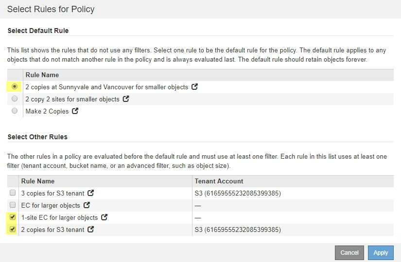

= Passo 3: Revise a Política de ILM
:allow-uri-read: 
:icons: font
:imagesdir: ../media/

[role="lead"]
A partir do passo 3 (rever a política ILM) do assistente do site de desintegração, você pode determinar se o site é referido pela política ILM ativa.

.Antes de começar
Você tem um bom entendimento de como o ILM funciona e está familiarizado com a criação de pools de armazenamento, perfis de codificação de apagamento, regras ILM e simulação e ativação de uma política ILM. link:../ilm/index.html["Gerenciar objetos com ILM"]Consulte .

.Sobre esta tarefa
O StorageGRID não pode desativar um site se esse site for referido por qualquer regra ILM na política ILM ativa.

Se sua política ILM atual se refere ao site que você deseja remover, você deve ativar uma nova política ILM que atenda a certos requisitos. Especificamente, a nova política ILM:

* Não é possível usar um pool de armazenamento que se refere ao site ou usa a opção todos os sites.
* Não é possível usar um perfil de codificação de apagamento que se refere ao site.
* Não é possível usar a regra fazer cópias 2 do StorageGRID 11,6 ou instalações anteriores.
* Deve ser projetado para proteger totalmente todos os dados de objetos.
+

IMPORTANT: Nunca crie uma regra ILM de cópia única para acomodar a remoção de um site. Uma regra de ILM que cria apenas uma cópia replicada para qualquer período de tempo coloca os dados em risco de perda permanente. Se houver apenas uma cópia replicada de um objeto, esse objeto será perdido se um nó de armazenamento falhar ou tiver um erro significativo. Você também perde temporariamente o acesso ao objeto durante procedimentos de manutenção, como atualizações.

Se você estiver executando um _Connected site Dedescomissionar_, você deve considerar como o StorageGRID deve gerenciar os dados do objeto atualmente no site que você deseja remover. Dependendo dos requisitos de proteção de dados, as novas regras podem mover os dados de objetos existentes para diferentes locais ou excluir quaisquer cópias de objetos extras que não sejam mais necessárias.

Entre em Contato com o suporte técnico se precisar de assistência para projetar a nova política.

.Passos
. Na Etapa 3 (revisar a Política ILM), determine se alguma regra ILM na política ILM ativa se refere ao site que você selecionou para remover.
. Se nenhuma regra estiver listada, selecione *Next* para ir para link:step-4-remove-ilm-references.html["Passo 4: Remover referências ILM"].
. Se uma ou mais regras ILM estiverem listadas na tabela, selecione o link ao lado de *Nome da política ativa*.
+
A página de políticas ILM aparece em uma nova guia do navegador. Use esta guia para atualizar o ILM. A página Decommission Site permanecerá aberta na outra guia.

+
.. Se necessário, selecione *ILM* > *Storage Pools* para criar um ou mais pools de armazenamento que não se referem ao site.
+

NOTE: Para obter detalhes, consulte as instruções para gerenciar objetos com gerenciamento do ciclo de vida das informações.

.. Se você planeja usar a codificação de apagamento, selecione *ILM* > *codificação de apagamento* para criar um ou mais perfis de codificação de apagamento.
+
Você deve selecionar pools de armazenamento que não se referem ao site.

+

NOTE: Não use o pool de storage *todos os nós de storage* (StorageGRID 11,6 e anteriores) nos perfis de codificação de apagamento.

. Selecione *ILM* > *regras* e clone cada uma das regras listadas na tabela para o passo 3 (revisar política ILM).
+

NOTE: Para obter detalhes, consulte as instruções para gerenciar objetos com gerenciamento do ciclo de vida das informações.

+
.. Use nomes que facilitem a seleção dessas regras em uma nova política.
.. Atualize as instruções de colocação.
+
Remova todos os pools de storage ou perfis de codificação de apagamento que se referem ao site e substitua-os por novos pools de storage ou perfis de codificação de apagamento.

+

NOTE: Não use o pool de armazenamento *todos os nós de storage* nas novas regras.

. Selecione *ILM* > *políticas* e crie uma nova política que use as novas regras.
+

NOTE: Para obter detalhes, consulte as instruções para gerenciar objetos com gerenciamento do ciclo de vida das informações.

+
.. Selecione a política ativa e selecione *Clone*.
.. Especifique um nome de política e um motivo para a alteração.
.. Selecione regras para a política clonada.
+
*** Limpe todas as regras listadas para o passo 3 (revisar a política ILM) da página do site de desintegração.
*** Selecione uma regra padrão que não se refira ao site.
+

NOTE: Não selecione a regra *Make 2 Copies* porque essa regra usa o pool de armazenamento *All Storage Nodes*, que não é permitido.

*** Selecione as outras regras de substituição que criou. Essas regras não devem se referir ao site.
+

.. Selecione *aplicar*.
.. Arraste as linhas para reordenar as regras na política.
+
Não é possível mover a regra padrão.

+

IMPORTANT: Você deve confirmar se as regras ILM estão na ordem correta. Quando a política é ativada, objetos novos e existentes são avaliados pelas regras na ordem listada, começando na parte superior.

.. Salve a política proposta.

. Ingira objetos de teste e simule a política proposta para garantir que as regras corretas sejam aplicadas.
+

CAUTION: Erros em uma política ILM podem causar perda de dados irrecuperável. Analise e simule cuidadosamente a política antes de ativá-la para confirmar que funcionará como pretendido.

+

CAUTION: Quando você ativa uma nova política de ILM, o StorageGRID a usa para gerenciar todos os objetos, incluindo objetos existentes e objetos recém-ingeridos. Antes de ativar uma nova política de ILM, revise todas as alterações no posicionamento de objetos replicados e codificados por apagamento existentes. Alterar a localização de um objeto existente pode resultar em problemas de recursos temporários quando os novos posicionamentos são avaliados e implementados.

. Ative a nova política.
+
Se você estiver executando uma desativação do site conetado, o StorageGRID começará a remover os dados do objeto do site selecionado assim que você ativar a nova política ILM. Mover ou excluir todas as cópias de objetos pode levar semanas. Embora você possa iniciar com segurança uma desativação do site enquanto os dados do objeto ainda existirem no site, o procedimento de desativação será concluído com mais rapidez e com menos interrupções e impactos no desempenho se você permitir que os dados sejam movidos do site antes de iniciar o procedimento de desativação real (selecionando *Start Decommission* no passo 5 do assistente).

. Volte para *passo 3 (revisar a política ILM)* para garantir que nenhuma regra ILM na nova política ativa consulte o site e o botão *Next* esteja ativado.
+
image::../media/decommission_site_step_3_no_rules.png[Desativar local passo 3 sem regras]

+

NOTE: Se alguma regra estiver listada, você deve criar e ativar uma nova política ILM antes de continuar.

. Se nenhuma regra estiver listada, selecione *Next*.
+
O passo 4 (Remover referências ILM) é exibido.

