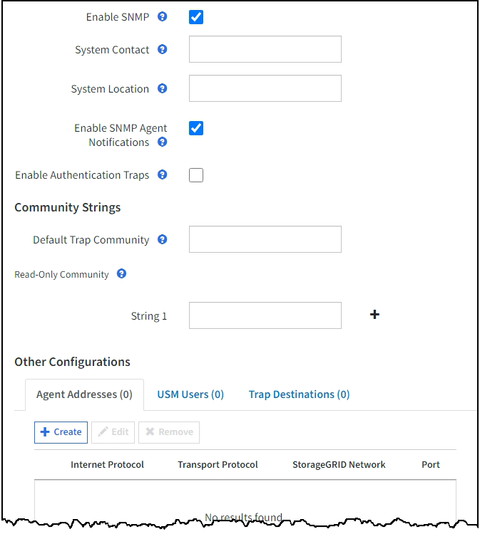
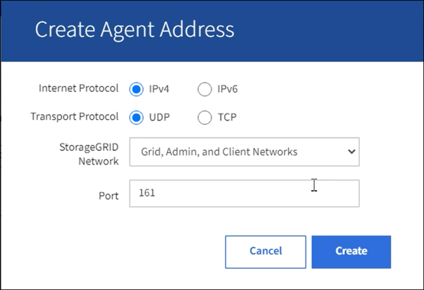

= Configure o agente SNMP
:allow-uri-read: 
:icons: font
:imagesdir: ../media/

[role="lead"]
Você pode configurar o agente SNMP do StorageGRID se quiser usar um sistema de gerenciamento SNMP de terceiros para acesso MIB somente leitura e notificações.

.Antes de começar
* Você está conetado ao Gerenciador de Grade usando um link:../admin/web-browser-requirements.html["navegador da web suportado"].
* Você tem a permissão de acesso root.

.Sobre esta tarefa
O agente SNMP do StorageGRID suporta todas as três versões do protocolo SNMP. Você pode configurar o agente para uma ou mais versões.

.Passos
. Selecione *CONFIGURATION* > *Monitoring* > *SNMP Agent*.
+
A página Agente SNMP é exibida.

+
image::../media/snmp_agent_not_enabled.png[Agente SNMP não ativado]

. Para ativar o agente SNMP em todos os nós de grade, marque a caixa de seleção *Enable SNMP* (Ativar SNMP*).
+
Os campos para configurar um agente SNMP são exibidos.

+

. No campo *Contato do sistema*, insira o valor que você deseja que o StorageGRID forneça nas mensagens SNMP para o sysContact.
+
Normalmente, o contacto do sistema é um endereço de correio eletrónico. O valor fornecido aplica-se a todos os nós do sistema StorageGRID. *O Contato do sistema* pode ter no máximo 255 carateres.

. No campo *localização do sistema*, insira o valor que você deseja que o StorageGRID forneça nas mensagens SNMP para sysLocation.
+
A localização do sistema pode ser qualquer informação útil para identificar onde o sistema StorageGRID está localizado. Por exemplo, você pode usar o endereço da rua de uma instalação. O valor fornecido aplica-se a todos os nós do sistema StorageGRID. *A localização do sistema* pode ter no máximo 255 carateres.

. Mantenha a caixa de seleção *Ativar notificações de agentes SNMP* selecionada se desejar que o agente SNMP do StorageGRID envie uma armadilha e informe notificações.
+
Se esta caixa de verificação estiver marcada, o agente SNMP suporta acesso MIB somente leitura, mas não envia nenhuma notificação SNMP.

. Marque a caixa de seleção *Enable Authentication traps* (Ativar traps de autenticação) se desejar que o agente SNMP do StorageGRID envie uma armadilha de autenticação se receber uma mensagem de protocolo autenticada incorretamente.
. Se você usar SNMPv1 ou SNMPv2c, complete a seção cadeias de Comunidade.
+
Os campos nesta seção são usados para autenticação baseada na comunidade em SNMPv1 ou SNMPv2c. Esses campos não se aplicam ao SNMPv3.

+
.. No campo *Default Trap Community* (Comunidade de Trap padrão), insira opcionalmente a cadeia de carateres da comunidade padrão que você deseja usar para destinos de trap.
+
Conforme necessário, você pode fornecer uma string de comunidade diferente (" personalizado ") quando você <<select_trap_destination,defina um destino específico da armadilha>>.

+
*A Comunidade de Trap padrão* pode ter no máximo 32 carateres e não pode conter carateres de espaço em branco.

.. Para *Comunidade somente leitura*, insira uma ou mais strings de comunidade para permitir acesso MIB somente leitura em endereços de agente IPv4 e IPv6. Selecione o sinal de adição image:../media/icon_plus_sign_black_on_white_old.png["Sinal positivo"]para adicionar várias cadeias de carateres.
+
Quando o sistema de gerenciamento consulta o MIB do StorageGRID, ele envia uma string de comunidade. Se a cadeia de carateres da comunidade corresponder a um dos valores especificados aqui, o agente SNMP enviará uma resposta ao sistema de gerenciamento.

+
Cada string de comunidade pode ter no máximo 32 carateres e não pode conter carateres de espaço em branco. Até cinco cordas são permitidas.

+

NOTE: Para garantir a segurança do seu sistema StorageGRID, não use "public" como a string da comunidade. Se você não inserir uma string de comunidade, o agente SNMP usará a ID de grade do seu sistema StorageGRID como a string de comunidade.

. Opcionalmente, selecione a guia endereços de agentes na seção outras configurações .
+
Use esta guia para especificar um ou mais ""endereços de escuta". Esses são os endereços StorageGRID nos quais o agente SNMP pode receber consultas. Cada endereço de agente inclui um protocolo de Internet, um protocolo de transporte, uma rede StorageGRID e, opcionalmente, uma porta.

+
Se você não configurar um endereço de agente, o endereço de escuta padrão será a porta UDP 161 em todas as redes StorageGRID.

+
.. Selecione *criar*.
+
A caixa de diálogo criar endereço do agente é exibida.

+

.. Para *Internet Protocol*, selecione se este endereço usará IPv4 ou IPv6.
+
Por padrão, o SNMP usa IPv4.

.. Para *Protocolo de Transporte*, selecione se este endereço usará UDP ou TCP.
+
Por padrão, o SNMP usa UDP.

.. No campo *rede StorageGRID*, selecione em qual rede StorageGRID a consulta será recebida.
+
*** Rede, administrador e redes de clientes: O StorageGRID deve ouvir consultas SNMP em todas as três redes.
*** Rede de rede
*** Rede de administração
*** Rede de clientes
+

NOTE: Para garantir que as comunicações do cliente com o StorageGRID permaneçam seguras, você não deve criar um endereço de agente para a rede do cliente.

.. No campo *Port*, insira opcionalmente o número da porta que o agente SNMP deve ouvir.
+
A porta UDP padrão para um agente SNMP é 161, mas você pode inserir qualquer número de porta não utilizado.

+

NOTE: Quando você salva o agente SNMP, o StorageGRID abre automaticamente as portas de endereço do agente no firewall interno. Você deve garantir que todos os firewalls externos permitam acesso a essas portas.

.. Selecione *criar*.
+
O endereço do agente é criado e adicionado à tabela.

+
image::../media/snmp_other_configurations_agent_addresses_table.png[Tabela de endereços de agentes de outras configurações SNMP]

. Se estiver a utilizar o SNMPv3, selecione o separador utilizadores USM na secção outras configurações.
+
Utilize este separador para definir os utilizadores USM que estão autorizados a consultar a MIB ou a receber traps e informações.

+

NOTE: Esta etapa não se aplica se você estiver usando apenas SNMPv1 ou SNMPv2c.

+
.. Selecione *criar*.
+
É apresentada a caixa de diálogo Create USM User (criar utilizador USM).

+
image::../media/snmp_create_usm_user.png[Utilizador SNMP USM]

.. Introduza um *Nome de utilizador* exclusivo para este utilizador USM.
+
Os nomes de usuário têm um máximo de 32 carateres e não podem conter carateres de espaço em branco. O nome de usuário não pode ser alterado depois que o usuário é criado.

.. Marque a caixa de seleção *Acesso MIB somente leitura* se esse usuário tiver acesso somente leitura à MIB.
+
Se você selecionar *Acesso MIB somente leitura*, o campo *ID do mecanismo autoritário* será desativado.

+

NOTE: Os utilizadores USM que tenham acesso MIB apenas de leitura não podem ter IDs de motor.

.. Se este utilizador for utilizado num destino de informação, introduza o *ID de motor autoritário* para este utilizador.
+

NOTE: SNMPv3 informar destinos devem ter usuários com IDs de motor. O destino da armadilha SNMPv3 não pode ter usuários com IDs de motor.

+
O ID oficial do mecanismo pode ser de 5 a 32 bytes em hexadecimal.

.. Selecione um nível de segurança para o utilizador USM.
+
*** *AuthPriv*: Este usuário se comunica com autenticação e privacidade (criptografia). Tem de especificar um protocolo de autenticação e uma palavra-passe, um protocolo de privacidade e uma palavra-passe.
*** *AuthNoPriv*: Este usuário se comunica com autenticação e sem privacidade (sem criptografia). Tem de especificar um protocolo de autenticação e uma palavra-passe.

.. Introduza e confirme a palavra-passe que este utilizador utilizará para autenticação.
+

NOTE: O único protocolo de autenticação suportado é SHA (HMAC-SHA-96).

.. Se selecionou *authPriv*, introduza e confirme a palavra-passe que este utilizador utilizará para a privacidade.
+

NOTE: O único protocolo de privacidade suportado é AES.

.. Selecione *criar*.
+
O utilizador USM é criado e adicionado à tabela.

+
image::../media/snmp_other_config_usm_users_table.png[Tabela de utilizador SNMP Other Config USM]

. [[Select_trap_destination, start-10]]na seção outras configurações, selecione a guia Trap Destinations.
+
A guia Destinos de armadilha permite definir um ou mais destinos para notificações de intercetação StorageGRID ou informar. Quando você ativa o agente SNMP e seleciona *Salvar*, o StorageGRID começa a enviar notificações para cada destino definido. As notificações são enviadas quando os alertas são acionados. As notificações padrão também são enviadas para as entidades MIB-II suportadas (por exemplo, ifdown e coldstart).

+
.. Selecione *criar*.
+
A caixa de diálogo criar destino de armadilha é exibida.

+
image::../media/snmp_create_trap_destination.png[SNMP criar destino de armadilha]

.. No campo *Version* (versão), selecione qual versão SNMP será utilizada para esta notificação.
.. Preencha o formulário, com base na versão selecionada
+
[cols="1a,2a"]
|===
| Versão | Especifique esta informação 

 a| 
SNMPv1

(Para SNMPv1, o agente SNMP só pode enviar traps. As informações não são suportadas.)
 a| 
... No campo *Host*, insira um endereço IPv4 ou IPv6 (ou FQDN) para receber a armadilha.
... Para *Port*, use o padrão (162), a menos que você precise usar outro valor. (162 é a porta padrão para traps SNMP.)
... Para *Protocolo*, use o padrão (UDP). TCP também é suportado. (UDP é o protocolo padrão de trap SNMP.)
... Use a comunidade de trap padrão, se uma foi especificada na página Agente SNMP, ou insira uma string de comunidade personalizada para esse destino de trap.
+
A string de comunidade personalizada pode ter no máximo 32 carateres e não pode conter espaço em branco.

 a| 
SNMPv2c
 a| 
... Selecione se o destino será usado para armadilhas ou informações.
... No campo *Host*, insira um endereço IPv4 ou IPv6 (ou FQDN) para receber a armadilha.
... Para *Port*, use o padrão (162), a menos que você precise usar outro valor. (162 é a porta padrão para traps SNMP.)
... Para *Protocolo*, use o padrão (UDP). TCP também é suportado. (UDP é o protocolo padrão de trap SNMP.)
... Use a comunidade de trap padrão, se uma foi especificada na página Agente SNMP, ou insira uma string de comunidade personalizada para esse destino de trap.
+
A string de comunidade personalizada pode ter no máximo 32 carateres e não pode conter espaço em branco.

 a| 
SNMPv3
 a| 
... Selecione se o destino será usado para armadilhas ou informações.
... No campo *Host*, insira um endereço IPv4 ou IPv6 (ou FQDN) para receber a armadilha.
... Para *Port*, use o padrão (162), a menos que você precise usar outro valor. (162 é a porta padrão para traps SNMP.)
... Para *Protocolo*, use o padrão (UDP). TCP também é suportado. (UDP é o protocolo padrão de trap SNMP.)
... Selecione o utilizador USM que será utilizado para autenticação.
+
**** Se selecionou *Trap*, apenas são apresentados utilizadores USM sem IDs de motor autoritativas.
**** Se selecionou *inform*, apenas são apresentados utilizadores USM com IDs de motor autoritativas.

|===
.. Selecione *criar*.
+
O destino da armadilha é criado e adicionado à tabela.

. Quando tiver concluído a configuração do agente SNMP, selecione *Save*.
+
A nova configuração do agente SNMP fica ativa.

.Informações relacionadas
link:silencing-alert-notifications.html["Silenciar notificações de alerta"]
