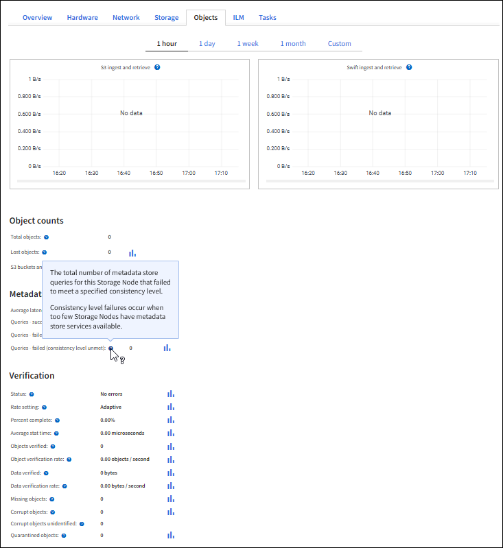

= Monitorar taxas de ingestão e recuperação de objetos
:allow-uri-read: 
:icons: font
:imagesdir: ../media/

[role="lead"]
Você pode monitorar taxas de ingestão e recuperação de objetos, bem como métricas para contagens de objetos, consultas e verificação. Você pode exibir o número de tentativas bem-sucedidas e com falha por aplicativos clientes para ler, gravar e modificar objetos no sistema StorageGRID.

.Passos
. Faça login no Gerenciador de Grade usando um link:../admin/web-browser-requirements.html["navegador da web suportado"].
. No painel de instrumentos, selecione *Performance* > *S3 operations* ou *Performance* > *Swift operations*.
+
Esta seção resume o número de operações do cliente realizadas pelo seu sistema StorageGRID. As taxas de protocolo são médias nos últimos dois minutos.

. Selecione *NODES*.
. Na página inicial dos nós (nível de implantação), clique na guia *Load Balancer*.
+
Os gráficos mostram tendências para todo o tráfego do cliente direcionado para pontos de extremidade do balanceador de carga dentro da grade. Você pode selecionar um intervalo de tempo em horas, dias, semanas, meses ou anos, ou pode aplicar um intervalo personalizado.

. Na home page dos nós (nível de implantação), clique na guia *objetos*.
+
O gráfico mostra as taxas de ingestão e recuperação de todo o seu sistema StorageGRID em bytes por segundo e total de bytes. Você pode selecionar um intervalo de tempo em horas, dias, semanas, meses ou anos, ou pode aplicar um intervalo personalizado.

. Para ver as informações de um nó de armazenamento específico, selecione o nó na lista à esquerda e clique na guia *Objects*.
+
O gráfico mostra as taxas de ingestão e recuperação de objetos para este nó de armazenamento. A guia também inclui métricas para contagens de objetos, consultas e verificação. Você pode clicar nos rótulos para ver as definições dessas métricas.

+

. Se você quiser ainda mais detalhes:
+
.. Selecione *SUPPORT* > *Tools* > *Grid topology*.
.. Selecione *_site_* > *Visão geral* > *Principal*.
+
A seção operações da API exibe informações resumidas para toda a grade.

.. Selecione *_Storage Node_* > *LDR* > *_client Application_* > *Overview* > *Main*
+
A seção operações exibe informações resumidas para o nó de armazenamento selecionado.

