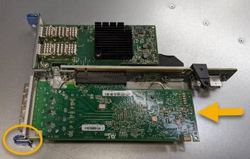

= Reinstale o HBA Fibre Channel
:allow-uri-read: 
:icons: font
:imagesdir: ../media/

[role="lead"]
O HBA Fibre Channel de substituição é instalado no mesmo local que o que foi removido.

.Antes de começar
* Tem a HBA Fibre Channel de substituição correta.
* Removeu a HBA Fibre Channel existente.
+
link:removing-fibre-channel-hba.html["Remova o HBA Fibre Channel"]

.Passos
. Enrole a extremidade da correia da pulseira ESD à volta do pulso e fixe a extremidade do clipe a um solo metálico para evitar descargas estáticas.
. Retire a HBA Fibre Channel de substituição da embalagem.
. Com a trava azul do adaptador na posição aberta, alinhe o HBA Fibre Channel com seu conetor no conjunto da riser; em seguida, pressione cuidadosamente o adaptador no conetor até que ele esteja totalmente assentado.
+

+
Há dois adaptadores no conjunto da riser: Um HBA Fibre Channel e um adaptador de rede Ethernet. A HBA Fibre Channel é indicada na ilustração.

. Localize o orifício de alinhamento no conjunto da riser (circulado) que se alinha com um pino guia na placa de sistema para garantir o posicionamento correto do conjunto da riser.
+
image::../media/sg6060_riser_alignment_hole.jpg[Orifício de alinhamento no conjunto da riser SG6060]

. Posicione o conjunto da riser no chassi, certificando-se de que ele se alinha com o conetor e o pino guia na placa de sistema; em seguida, insira o conjunto da riser.
. Pressione cuidadosamente o conjunto da riser no lugar ao longo de sua linha central, ao lado dos orifícios marcados com azul, até que esteja totalmente assentado.
. Retire as tampas de proteçãoão das portas HBA Fibre Channel onde irá reinstalar os cabos.

.Depois de terminar
Se não houver outros procedimentos de manutenção a serem executados no controlador, reinstale a tampa do controlador.

link:reinstalling-sg6000-cn-controller-cover.html["Reinstale a tampa do controlador SG6000-CN"]
